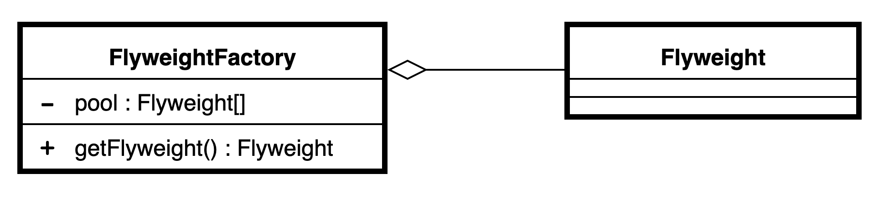

# Flyweight and Flyweight Factory
This project implements a Flyweight out of a simple pixel object containing row, column, and color information (java example). **Pixel** class contains extrinsic information (row, col) as local info, and intrinsic information (color) as a reference to **Color** objects in a static list of Colors. The list is implemented in a Factory method called **PixelInctrinsicData** allowing pixels with the same intrinsic information to share data and save memory resources [3]. The example in python simulates a police database where a **Flyweight factory** stores the common information of cars (intrinsic information) for the same porpouse of saving RAM memory during run-time [2].

## Flyweight pattern
In computer programming, flyweight is a software design pattern. A flyweight is an object that minimizes memory usage by sharing as much data as possible with other similar objects; it is a way to use objects in large numbers when a simple repeated representation would use an unacceptable amount of memory. Often some parts of the object state can be shared, and it is common practice to hold them in external data structures and pass them to the objects temporarily when they are used [1].

## Flyweight Factory
The Flyweight Factory manages a pool of existing flyweights. With the factory, clients don’t create flyweights directly. Instead, they call the factory, passing it bits of the intrinsic state of the desired flyweight. The factory looks over previ- ously created flyweights and either returns an existing one that matches search criteria or creates a new one if nothing is found [2].

\
Fig. 1 - UML class design

## References
[1] - [Flyweight Pattern Wikipedia](https://en.wikipedia.org/wiki/Flyweight_pattern)\
[2] - SHVETS, Alexander. Dive Into Design Patterns. Refactoring. Guru, 2018.
\
[3] - [PPCU, Budapest. Design Patterns](http://ipcv.eu/blog/course/programming-methodology/)